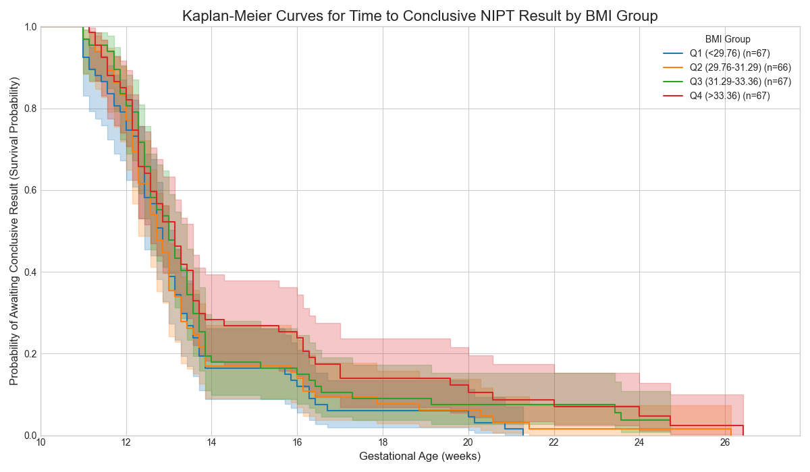

# Task 2: Survival Analysis for Optimal NIPT Timing - Report

This document outlines the methodology and results of the survival analysis performed to determine the optimal gestational week for Non-Invasive Prenatal Testing (NIPT), stratified by maternal Body Mass Index (BMI).

## 1. Objective

The primary goal is to identify the ideal testing window that minimizes the risk of test failure (i.e., not obtaining a conclusive result for the Y chromosome) while also considering the cost associated with delaying the test. The analysis is performed separately for different BMI groups to provide tailored recommendations.

## 2. Data Preparation (`data_prepare.py`)

The analysis relies on a preprocessed dataset generated by the `data_prepare.py` script. The key preparation steps include:

1.  **Data Merging**: Merged `dataA.csv` and `dataB.csv`.
2.  **Data Cleaning & Quality Control**: Filtered records based on stringent quality metrics (e.g., read counts, GC content) and handled missing values.
3.  **Time-to-Event Data Creation**: 
    *   **Event**: Defined as the first time a sample's Y-chromosome concentration meets or exceeds the threshold of `0.04`. The time of the event is the corresponding gestational week.
    *   **Censoring**: If a patient never reaches the threshold across all their tests, they are "right-censored." The time is recorded as their last known gestational week of testing.
4.  **BMI Grouping**: To ensure consistency, each mother was assigned to a BMI group based on the BMI recorded at her *first* test. The groups were determined by the quartiles of the BMI distribution across all patients:
    *   **Q1**: BMI < 29.76
    *   **Q2**: BMI between 29.76 and 31.29
    *   **Q3**: BMI between 31.29 and 33.36
    *   **Q4**: BMI > 33.36

The final dataset, `time_to_event_dataset_grouped.csv`, contains the time, event status, and BMI group for each patient.

## 3. Survival Analysis (`T2_analysis.py`)

The core analysis was conducted using the `lifelines` library in Python.

### 3.1. Kaplan-Meier Survival Curves

We generated Kaplan-Meier survival curves for each BMI quartile group. The "survival probability" in this context represents the probability of *not yet having received a conclusive result*. A steeper drop in the curve indicates a higher rate of achieving a conclusive result.

**Resulting Plot:** `results_T2/kaplan_meier_curves_grouped.png`

### 3.2. Optimal Week Determination via Risk Analysis

To find the best week to test, we defined a simple risk function:

**Risk(g) = (Cost of Failure * Probability of Failure at week g) + (Cost of Delay * Weeks of Delay)**

Where:
*   **Probability of Failure at week g**: This is the survival probability S(g) from the Kaplan-Meier curve.
*   **Cost of Failure**: Assumed to be `1.0` (normalized unit).
*   **Cost of Delay**: Assumed to be `0.05` per week, relative to a baseline of 10 weeks.

The optimal week for each BMI group is the week `g` that minimizes this risk function.

**Resulting Plot:** `results_T2/risk_vs_gestational_week_grouped.png`

### 3.3. Bootstrap for Confidence Intervals

To assess the stability and reliability of our optimal week calculation, we performed a bootstrap analysis with 500 resamples. This technique involves repeatedly sampling the dataset with replacement and recalculating the optimal week for each sample. This process generates a distribution of optimal weeks, from which we can derive a 95% confidence interval.

## 4. Results

The analysis yielded the following optimal testing weeks and confidence intervals for each BMI group:

| BMI Group         | Optimal Week | 95% Confidence Interval |
| ----------------- | :----------: | :---------------------: |
| **Q1 (<29.76)**   |      15      |    (14.00, 17.00)       |
| **Q2 (29.76-31.29)**|      14      |    (14.00, 14.00)       |
| **Q3 (31.29-33.36)**|      14      |    (14.00, 14.00)       |
| **Q4 (>33.36)**   |      15      |    (14.00, 17.00)       |

## 5. Conclusion

The analysis suggests that for mothers in the middle 50% of the BMI distribution (Q2 and Q3), testing at **week 14** is optimal. For those in the lowest (Q1) and highest (Q4) BMI quartiles, the optimal time is slightly later, at **week 15**, with a wider confidence interval suggesting more variability.

This concludes the analysis for Task 2. All scripts and results are located in the `scripts_T2_v1.1` directory.