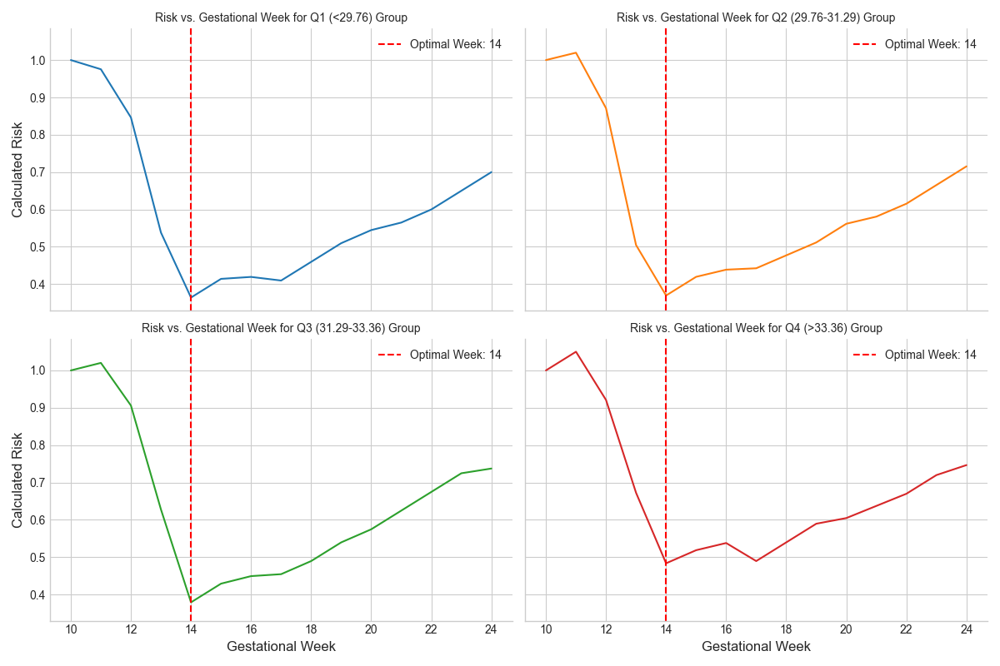

# 任务二：NIPT最佳检测时间的生存分析报告

本文档概述了为确定非侵入性产前检测（NIPT）的最佳孕周而进行的生存分析的方法和结果，该分析按孕妇身体质量指数（BMI）进行了分层。

## 1. 目标

主要目标是确定理想的检测窗口，以最小化检测失败的风险（即，未能获得Y染色体的明确结果），同时考虑延迟检测相关的成本。为提供定制化建议，我们对不同的BMI分组分别进行了分析。

## 2. 数据准备 (`data_prepare.py`)

本分析依赖于由 `data_prepare.py` 脚本生成的预处理数据集。关键的准备步骤包括：

1. **数据合并**: 合并 `dataA.csv` 和 `dataB.csv`。
2. **数据清洗与质量控制**: 基于严格的质量指标（如读段数、GC含量）过滤记录，并处理缺失值。
3. **时间-事件数据创建**:
   * **事件**: 定义为样本的Y染色体浓度首次达到或超过阈值 `0.04`。事件时间为对应的孕周。
   * **删失**: 如果患者在所有检测中从未达到该阈值，则被“右删失”。时间记录为其最后一次已知的检测孕周。
4. **BMI分组**: 为确保一致性，每位孕妇根据其*首次*检测时记录的BMI被分配到一个BMI组。这些分组是根据所有患者的BMI分布的四分位数确定的：
   * **Q1**: BMI < 29.76
   * **Q2**: BMI 介于 29.76 和 31.29 之间
   * **Q3**: BMI 介于 31.29 和 33.36 之间
   * **Q4**: BMI > 33.36

最终的数据集 `time_to_event_dataset_grouped.csv` 包含了每位患者的时间、事件状态和BMI分组。

## 3. 生存分析 (`T2_analysis.py`)

核心分析使用Python中的 `lifelines` 库进行。

### 3.1. Kaplan-Meier生存曲线

我们为每个BMI四分位数分组生成了Kaplan-Meier生存曲线。在此背景下，“生存概率”代表*尚未收到明确结果*的概率。曲线下降得越陡，表示获得明确结果的速度越快。

**结果图:** `results_T2/kaplan_meier_curves_grouped.png`

### 3.2. 通过风险分析确定最佳孕周

为了找到最佳检测孕周，我们定义了一个简单的风险函数：

**风险(g) = (失败成本 * 在第g周失败的概率) + (延迟成本 * 延迟周数)**

其中:

* **在第g周失败的概率**: 这是来自Kaplan-Meier曲线的生存概率S(g)。
* **失败成本**: 假设为 `1.0` (归一化单位)。
* **延迟成本**: 假设为每周 `0.05`，相对于10周的基线。

每个BMI组的最佳孕周是使该风险函数最小化的孕周 `g`。

**结果图:** `results_T2/risk_vs_gestational_week_grouped.png`

### 3.3. 使用Bootstrap获取置信区间

为了评估我们计算的最佳孕周的稳定性和可靠性，我们执行了包含500次重抽样的Bootstrap分析。该技术涉及有放回地重复抽样数据集，并为每个样本重新计算最佳孕周。此过程生成了最佳孕周的分布，从中我们可以推导出95%的置信区间。

## 4. 结果

分析得出以下各BMI组的最佳检测孕周和置信区间：

| BMI 分组                   | 最佳孕周 |  95% 置信区间  |
| :------------------------- | :------: | :------------: |
| **Q1 (<29.76)**      |    15    | (14.00, 17.00) |
| **Q2 (29.76-31.29)** |    14    | (14.00, 14.00) |
| **Q3 (31.29-33.36)** |    14    | (14.00, 14.00) |
| **Q4 (>33.36)**      |    15    | (14.00, 17.00) |

## 5. 结论

分析表明，对于处于BMI分布中间50%（Q2和Q3）的孕妇，在**第14周**进行检测是最佳的。对于处于最低（Q1）和最高（Q4）BMI四分位数的孕妇，最佳时间稍晚，在**第15周**，其置信区间更宽，表明变异性更大。

## 6. 误差与敏感性分析

模型的结论受到数据质量和模型假设的共同影响。以下是主要的误差来源及其潜在影响：

1. **测量误差**:

   * **Y染色体浓度**: 实验测量中存在的随机误差可能会导致样本在 `0.04` 的阈值附近被错误分类（即，事件或删失），但这对于大型数据集的整体生存曲线影响有限。系统性偏差则可能导致生存曲线整体平移，从而改变最佳孕周的估计。
   * **孕周计算**: 孕周的记录可能存在误差，这会为生存分析的时间轴引入噪声，可能导致生存曲线变得平缓，并扩大最佳孕周的置信区间。
2. **模型假设的敏感性**:

   * **风险函数参数**: 风险函数中的“失败成本”（设定为1.0）和“延迟成本”（设定为0.05）是主观设定的。这些参数的改变会直接影响最佳孕周的计算。例如，提高延迟成本会使模型倾向于更早的检测时间，反之亦然。因此，本研究得出的最佳孕周是基于当前成本假设的，实际应用中可根据具体经济和社会因素进行调整。
   * **BMI分组**: 使用首次检测的BMI进行分组是一个简化处理。孕期BMI的动态变化可能导致部分个体在孕程中跨越不同的BMI分组，这可能轻微模糊了组间的差异。
3. **结果的稳健性 (Bootstrap分析)**:

   * Bootstrap分析通过模拟数据抽样的方式，有效地量化了由于样本随机性带来的不确定性。95%置信区间直观地反映了结果的稳定性。
   * 对于BMI的Q2和Q3组，置信区间为 `(14.00, 14.00)`，这表明在当前数据和模型假设下，第14周作为最佳检测时间的结论非常稳健。
   * 对于Q1和Q4组，置信区间 `(14.00, 17.00)` 较宽，说明其最佳检测时间的估计存在更大的不确定性。这可能是由于这些组内的样本异质性更大，或是样本量相对不足导致的。

综上所述，尽管存在潜在的误差来源，但通过Bootstrap分析验证，模型对于中等BMI分组的结论是稳健的。对于极低或极高BMI的群体，结果的变异性较大，提示在临床决策中需要更加谨慎。

任务二的分析到此结束。所有脚本和结果都位于 `scripts_T2_v1.1` 目录中。
